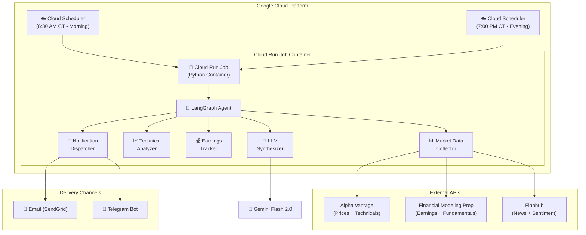
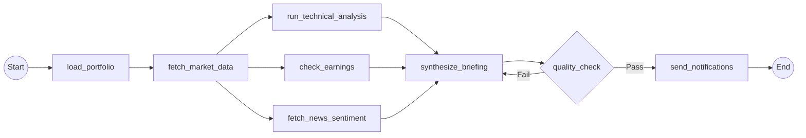
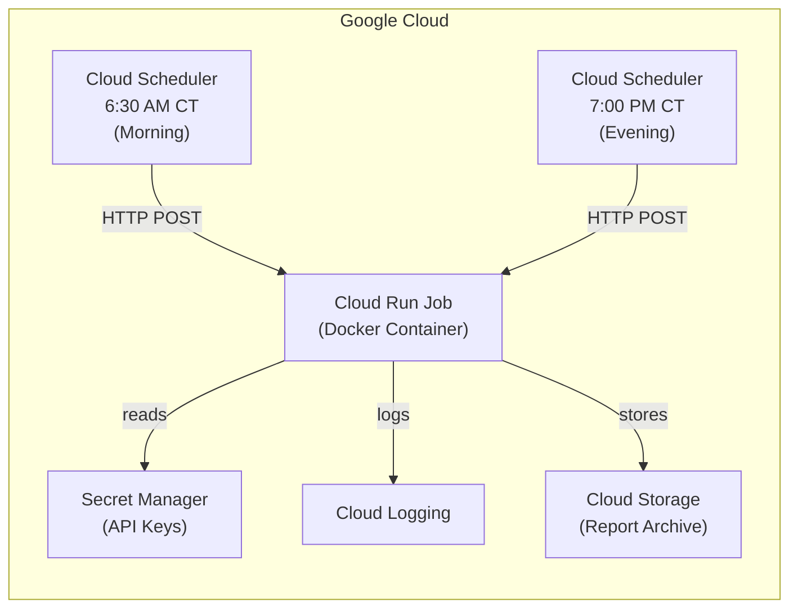

# Stock Portfolio Monitoring Agent — Technical Implementation Plan

## 🎯 Goal

Build an autonomous AI agent that:
1. **Monitors** your stock portfolio (holdings across multiple accounts)
2. **Delivers daily briefings** — Morning pre-market + Evening post-market
3. **Tracks earnings** — Alerts before/after earnings releases
4. **Runs technical analysis** — RSI, MACD, Moving Averages, Bollinger Bands
5. **Generates actionable recommendations** — Buy/Sell/Hold signals with reasoning
6. **Runs on Google Cloud** — Serverless, cost-effective (~$5-15/month)

---

## 🏗️ System Architecture



---

## 📂 Project Structure

```
stock-portfolio-agent/
├── README.md
├── pyproject.toml                    # Dependencies & project metadata
├── Dockerfile                        # Container for Cloud Run
├── .env.example                      # Template for secrets
├── .github/
│   └── workflows/
│       └── deploy.yml                # CI/CD to Cloud Run
│
├── config/
│   ├── portfolio.yaml                # Your holdings & accounts
│   ├── watchlist.yaml                # Additional stocks to monitor
│   └── settings.yaml                 # Agent behavior settings
│
├── src/
│   ├── __init__.py
│   ├── main.py                       # Entrypoint — invoked by Cloud Run
│   │
│   ├── agent/
│   │   ├── __init__.py
│   │   ├── graph.py                  # LangGraph workflow definition
│   │   ├── state.py                  # AgentState (TypedDict/Pydantic)s
│   │   └── nodes/
│   │       ├── __init__.py
│   │       ├── market_data.py        # Fetch prices, volume, market status
│   │       ├── technical_analysis.py # RSI, MACD, MA, Bollinger Bands
│   │       ├── earnings_tracker.py   # Upcoming/recent earnings + surprises
│   │       ├── news_sentiment.py     # News headlines + sentiment scoring
│   │       ├── synthesizer.py        # LLM generates the briefing
│   │       └── notifier.py           # Email / Telegram dispatch
│   │
│   ├── data/
│   │   ├── __init__.py
│   │   ├── alpha_vantage.py          # Alpha Vantage API client
│   │   ├── fmp_client.py             # Financial Modeling Prep client
│   │   ├── finnhub_client.py         # Finnhub API client
│   │   └── cache.py                  # Simple file/Redis cache layer
│   │
│   ├── models/
│   │   ├── __init__.py
│   │   ├── portfolio.py              # Portfolio, Holding, Account models
│   │   ├── market.py                 # Quote, OHLCV, TechnicalIndicator
│   │   ├── earnings.py               # EarningsEvent, EarningsSurprise
│   │   └── report.py                 # DailyBriefing, Recommendation
│   │
│   ├── notifications/
│   │   ├── __init__.py
│   │   ├── email_sender.py           # SendGrid integration
│   │   ├── telegram_bot.py           # Telegram Bot API
│   │   └── templates/
│   │       ├── morning_briefing.html  # Email HTML template
│   │       └── evening_briefing.html
│   │
│   └── utils/
│       ├── __init__.py
│       ├── config.py                 # Load YAML configs
│       └── logging.py               # Structured logging (Cloud Logging)
│
├── tests/
│   ├── __init__.py
│   ├── conftest.py
│   ├── test_market_data.py
│   ├── test_technical_analysis.py
│   ├── test_earnings_tracker.py
│   ├── test_synthesizer.py
│   └── test_graph.py                # End-to-end agent test
│
├── scripts/
│   ├── setup_gcp.sh                  # One-time GCP setup script
│   └── run_local.py                  # Local testing entrypoint
│
└── docs/
    └── architecture.md               # This document (simplified)
```

---

## 🔧 Technology Stack

| Layer | Technology | Why |
|---|---|---|
| **Orchestration** | LangGraph (Python) | Stateful graph-based agent with cyclic workflows, checkpointing |
| **LLM** | Google Gemini 2.0 Flash | Cost-effective, fast, great for synthesis & reasoning |
| **Market Data** | Alpha Vantage (free tier) | Built-in technical indicators, reliable JSON API |
| **Earnings/Fundamentals** | Financial Modeling Prep (free tier) | Best free earnings calendar + financial statements |
| **News/Sentiment** | Finnhub (free tier) | Real-time news + market sentiment |
| **Email** | SendGrid (free tier: 100/day) | Reliable transactional email with HTML templates |
| **Alerts** | Telegram Bot API (free) | Instant mobile push notifications |
| **Compute** | Google Cloud Run Jobs | Serverless, scale-to-zero, pay-per-execution |
| **Scheduler** | Google Cloud Scheduler | Cron-based triggers, 3 free jobs/month |
| **Secrets** | Google Secret Manager | Securely store API keys |
| **Logging** | Google Cloud Logging | Built-in with Cloud Run |
| **CI/CD** | GitHub Actions | Auto-deploy on push to main |
| **Language** | Python 3.12+ | Best ecosystem for financial data + LLM |

---

## 🧠 Agent Graph Design (LangGraph)



### Agent State

```python
from typing import TypedDict, Literal
from pydantic import BaseModel

class AgentState(TypedDict):
    # Run context
    run_id: str
    run_type: Literal["morning", "evening"]
    timestamp: str
    
    # Portfolio
    portfolio: dict              # Holdings loaded from config
    
    # Market data (populated by fetch node)
    quotes: list[dict]           # Current/closing prices per holding
    market_summary: dict         # S&P 500, NASDAQ, VIX, etc.
    
    # Technical analysis (populated by TA node)
    technical_signals: list[dict]  # Per-stock: RSI, MACD, MA signals
    
    # Earnings (populated by earnings node)
    upcoming_earnings: list[dict]  # Next 7 days
    recent_surprises: list[dict]   # Last 7 days beat/miss
    
    # News (populated by news node)
    news_headlines: list[dict]     # Relevant news per holding
    sentiment_scores: dict         # Per-stock sentiment
    
    # LLM output (populated by synthesizer)
    briefing: dict                 # The final daily report
    recommendations: list[dict]    # Buy/Hold/Sell per stock
    
    # Quality
    quality_score: float
    retry_count: int
```

### Node Implementations (Summary)

| Node | Input | Output | Details |
|---|---|---|---|
| `load_portfolio` | Config YAML | `portfolio` | Reads your holdings, accounts, cost basis |
| `fetch_market_data` | `portfolio` | `quotes`, `market_summary` | Calls Alpha Vantage for each ticker; fetches indices |
| `run_technical_analysis` | `quotes` | `technical_signals` | RSI(14), MACD, SMA(50/200), Bollinger Bands per ticker |
| `check_earnings` | `portfolio` | `upcoming_earnings`, `recent_surprises` | FMP earnings calendar ±7 days from today |
| `fetch_news_sentiment` | `portfolio` | `news_headlines`, `sentiment_scores` | Finnhub company news + sentiment |
| `synthesize_briefing` | All above | `briefing`, `recommendations` | Gemini Flash generates structured daily report |
| `quality_check` | `briefing` | Pass/Fail routing | Validates completeness, retries once if needed |
| `send_notifications` | `briefing` | — | Sends formatted email + Telegram message |

---

## 📋 Portfolio Configuration

```yaml
# config/portfolio.yaml
accounts:
  - name: "Robinhood - Individual"
    broker: "robinhood"
    holdings:
      - ticker: "AAPL"
        shares: 50
        cost_basis: 178.25
      - ticker: "NVDA"
        shares: 30
        cost_basis: 485.50
      - ticker: "MSFT"
        shares: 25
        cost_basis: 380.00
      - ticker: "GOOGL"
        shares: 20
        cost_basis: 140.75

  - name: "Fidelity - Roth IRA"
    broker: "fidelity"
    holdings:
      - ticker: "VOO"
        shares: 100
        cost_basis: 420.00
      - ticker: "QQQ"
        shares: 50
        cost_basis: 380.00

watchlist:
  - "TSLA"
  - "AMD"
  - "AMZN"
  - "META"
```

```yaml
# config/settings.yaml
schedule:
  morning:
    time: "06:30"      # CT
    timezone: "America/Chicago"
  evening:
    time: "19:00"      # CT
    timezone: "America/Chicago"

notifications:
  email:
    enabled: true
    to: "rakesh@example.com"
  telegram:
    enabled: true
    chat_id: "YOUR_CHAT_ID"

analysis:
  technical_indicators:
    - rsi_14
    - macd
    - sma_50
    - sma_200
    - bollinger_bands
  earnings_lookback_days: 7
  earnings_lookahead_days: 7
  news_max_per_stock: 5

llm:
  model: "gemini-2.0-flash"
  temperature: 0.3
  max_retries: 1
```

---

## 📧 Sample Morning Briefing Output

```
━━━━━━━━━━━━━━━━━━━━━━━━━━━━━━━━━━━━━━━━
📊 MORNING BRIEFING — Monday, Apr 21, 2026
━━━━━━━━━━━━━━━━━━━━━━━━━━━━━━━━━━━━━━━━

🌍 MARKET OVERVIEW
• S&P 500: 5,842 (+0.3% pre-market) 
• NASDAQ: 18,620 (+0.5% pre-market)
• VIX: 14.2 (low volatility)
• 10Y Treasury: 4.15%

📈 YOUR PORTFOLIO ($284,500 → +1.2% today)
┌──────┬────────┬─────────┬──────────┬────────────┐
│ Tick │ Price  │ Change  │ P&L      │ Signal     │
├──────┼────────┼─────────┼──────────┼────────────┤
│ NVDA │ $892   │ +3.2%   │ +$12,195 │ 🟢 STRONG │
│ AAPL │ $198   │ +0.5%   │ +$987    │ 🟡 HOLD   │
│ MSFT │ $425   │ -0.2%   │ +$1,125  │ 🟡 HOLD   │
│ GOOGL│ $178   │ +1.1%   │ +$745    │ 🟢 BUY    │
└──────┴────────┴─────────┴──────────┴────────────┘

⚡ KEY ALERTS
1. 🔴 NVDA earnings THIS WEDNESDAY (Apr 23) after close
   → Whisper: $6.12 EPS vs consensus $5.90
   → IV rank: 85% — options are expensive
   
2. 🟢 GOOGL golden cross: SMA-50 crossed above SMA-200
   → Historically bullish signal (72% win rate)

3. 🟡 AAPL RSI at 68 — approaching overbought territory
   → Consider trimming if RSI > 72

📰 TOP NEWS
• NVDA: "Jensen Huang keynote to reveal next-gen Blackwell Ultra"
• GOOGL: "Waymo expands to 10 new cities, revenue up 40% YoY"

💡 RECOMMENDATIONS
• NVDA: Hold through earnings IF risk-tolerant. Set stop at $840.
• GOOGL: Accumulate — technical + fundamental alignment.
• AAPL: Watch RSI closely. No action yet.
━━━━━━━━━━━━━━━━━━━━━━━━━━━━━━━━━━━━━━━━
```

---

## ☁️ Google Cloud Deployment

### Architecture



### Estimated Monthly Cost

| Service | Usage | Cost |
|---|---|---|
| Cloud Run Jobs | ~60 runs × 2-3 min × 1 vCPU / 512MB | **~$0.50** (within free tier) |
| Cloud Scheduler | 2 jobs (morning + evening) | **Free** (3 free jobs) |
| Secret Manager | 5 secrets × 60 accesses | **Free** (6 active versions free) |
| Cloud Storage | ~10MB reports/month | **Free** (5GB free) |
| Gemini 2.0 Flash API | ~60 calls × ~2K tokens each | **~$0.10** |
| Alpha Vantage | Free tier (25 calls/day) | **Free** |
| Financial Modeling Prep | Free tier (250 calls/day) | **Free** |
| Finnhub | Free tier (60 calls/min) | **Free** |
| SendGrid | Free tier (100 emails/day) | **Free** |
| **TOTAL** | | **~$1-5/month** |

> [!TIP]
> This entire stack can run within Google Cloud's **Always Free** tier for most months. You'd only incur charges if you scale up significantly.

### Dockerfile

```dockerfile
FROM python:3.12-slim

WORKDIR /app

COPY pyproject.toml .
RUN pip install --no-cache-dir .

COPY . .

# Cloud Run Jobs execute this command
CMD ["python", "-m", "src.main"]
```

### Cloud Setup Script (`scripts/setup_gcp.sh`)

```bash
#!/bin/bash
set -euo pipefail

PROJECT_ID="stock-portfolio-agent"
REGION="us-central1"
JOB_NAME="portfolio-agent"
SA_NAME="portfolio-agent-sa"

# 1. Create service account
gcloud iam service-accounts create $SA_NAME \
  --display-name="Portfolio Agent Service Account"

# 2. Grant permissions
SA_EMAIL="${SA_NAME}@${PROJECT_ID}.iam.gserviceaccount.com"
gcloud projects add-iam-policy-binding $PROJECT_ID \
  --member="serviceAccount:${SA_EMAIL}" \
  --role="roles/secretmanager.secretAccessor"

# 3. Store API keys in Secret Manager
gcloud secrets create alpha-vantage-key --replication-policy="automatic"
gcloud secrets create fmp-api-key --replication-policy="automatic"
gcloud secrets create finnhub-api-key --replication-policy="automatic"
gcloud secrets create sendgrid-api-key --replication-policy="automatic"
gcloud secrets create telegram-bot-token --replication-policy="automatic"
gcloud secrets create gemini-api-key --replication-policy="automatic"

echo "Now set secret values with:"
echo "  echo -n 'YOUR_KEY' | gcloud secrets versions add SECRET_NAME --data-file=-"

# 4. Build & push container
gcloud builds submit --tag gcr.io/$PROJECT_ID/$JOB_NAME

# 5. Deploy Cloud Run Job
gcloud run jobs create $JOB_NAME \
  --image gcr.io/$PROJECT_ID/$JOB_NAME \
  --region $REGION \
  --service-account $SA_EMAIL \
  --memory 512Mi \
  --cpu 1 \
  --task-timeout 300s \
  --max-retries 1 \
  --set-env-vars="RUN_TYPE=morning"

# 6. Create Cloud Scheduler jobs
# Morning briefing at 6:30 AM CT (11:30 UTC)
gcloud scheduler jobs create http morning-briefing \
  --schedule="30 11 * * 1-5" \
  --uri="https://${REGION}-run.googleapis.com/apis/run.googleapis.com/v1/namespaces/${PROJECT_ID}/jobs/${JOB_NAME}:run" \
  --http-method=POST \
  --message-body='{"overrides":{"containerOverrides":[{"env":[{"name":"RUN_TYPE","value":"morning"}]}]}}' \
  --oauth-service-account-email=$SA_EMAIL \
  --location=$REGION

# Evening briefing at 7:00 PM CT (00:00 UTC next day)
gcloud scheduler jobs create http evening-briefing \
  --schedule="0 0 * * 2-6" \
  --uri="https://${REGION}-run.googleapis.com/apis/run.googleapis.com/v1/namespaces/${PROJECT_ID}/jobs/${JOB_NAME}:run" \
  --http-method=POST \
  --message-body='{"overrides":{"containerOverrides":[{"env":[{"name":"RUN_TYPE","value":"evening"}]}]}}' \
  --oauth-service-account-email=$SA_EMAIL \
  --location=$REGION

echo "✅ Setup complete!"
```

---

## 🔑 API Keys Required

| Service | Sign Up | Free Tier |
|---|---|---|
| Alpha Vantage | [alphavantage.co/support/#api-key](https://www.alphavantage.co/support/#api-key) | 25 requests/day |
| Financial Modeling Prep | [financialmodelingprep.com/developer](https://site.financialmodelingprep.com/developer/docs/) | 250 requests/day |
| Finnhub | [finnhub.io/register](https://finnhub.io/register) | 60 calls/min |
| Google Gemini | [aistudio.google.com](https://aistudio.google.com/apikey) | Free tier available |
| SendGrid | [sendgrid.com/free](https://sendgrid.com/en-us/free) | 100 emails/day |
| Telegram Bot | [BotFather on Telegram](https://t.me/BotFather) | Free |

---

## 📅 Phased Build Timeline

### Phase 1 — Foundation (Week 1) `← START HERE`
- [ ] Project scaffolding (pyproject.toml, folder structure)
- [ ] Pydantic models for Portfolio, Holdings, Quotes
- [ ] YAML config loader
- [ ] Alpha Vantage client (prices + technical indicators)
- [ ] Basic LangGraph workflow: load → fetch → print
- [ ] Local testing with `scripts/run_local.py`

### Phase 2 — Analysis & Synthesis (Week 2)
- [x] Technical analysis node (RSI, MACD, SMA, Bollinger)
- [x] FMP earnings tracker client + node
- [x] Finnhub news/sentiment client + node
- [x] Gemini Flash synthesizer node (generate briefing)
- [x] Quality check node with retry logic

### Phase 3 — Notifications & Templates (Week 3)
- [x] HTML email templates (morning + evening variants)
- [x] SendGrid email sender
- [x] Telegram bot notification
- [x] End-to-end graph test

### Phase 4 — Cloud Deployment (Week 4)
- [x] Dockerfile + container build
- [x] GCP setup (Secret Manager, Cloud Run Job)
- [x] Cloud Scheduler cron jobs
- [x] GitHub Actions CI/CD pipeline
- [x] Cloud Logging + alerting on failures
- [x] Archive reports to Cloud Storage

---

## ⚠️ Important Considerations

> [!WARNING]
> **This is NOT a trading bot.** It provides informational insights only. Never blindly execute trades based on AI recommendations. Always do your own due diligence.

> [!IMPORTANT]
> **API Rate Limits:** With Alpha Vantage's free tier (25 calls/day), you can monitor ~10-12 unique tickers per run (price + technicals = 2 calls each). If your portfolio exceeds this, consider:
> - Upgrading to Alpha Vantage premium ($49.99/month for 75 requests/min)
> - Using `yfinance` as a fallback (unofficial, but free and unlimited)
> - Caching aggressively between morning/evening runs

> [!NOTE]
> **Morning vs Evening Briefings:**
> - **Morning (6:30 AM CT):** Pre-market movers, overnight news, earnings due today, key levels to watch
> - **Evening (7:00 PM CT):** Day's performance recap, after-hours moves, earnings results, next-day preview
